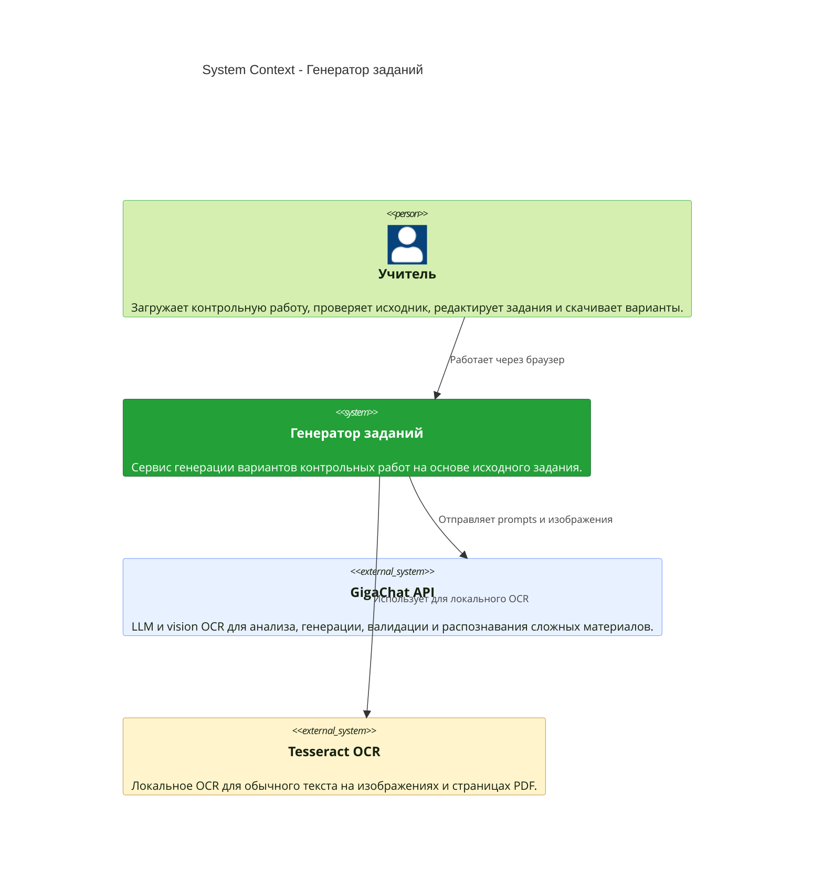
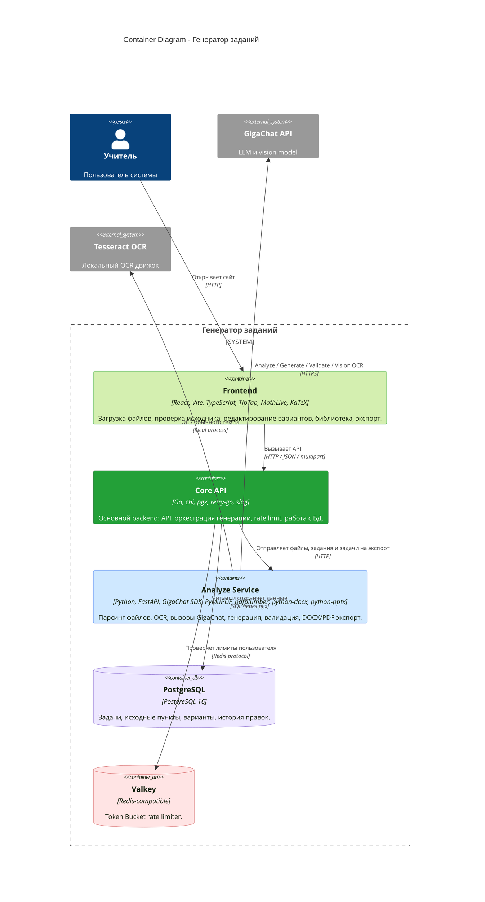
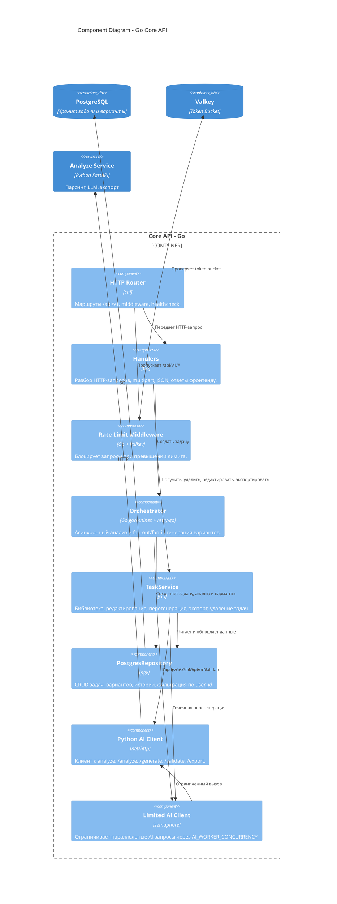
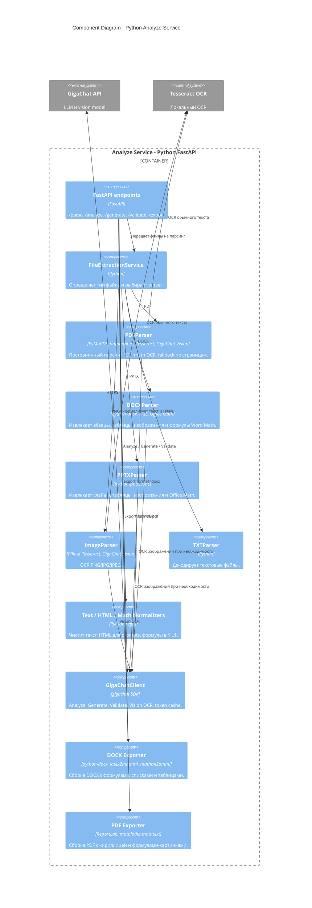
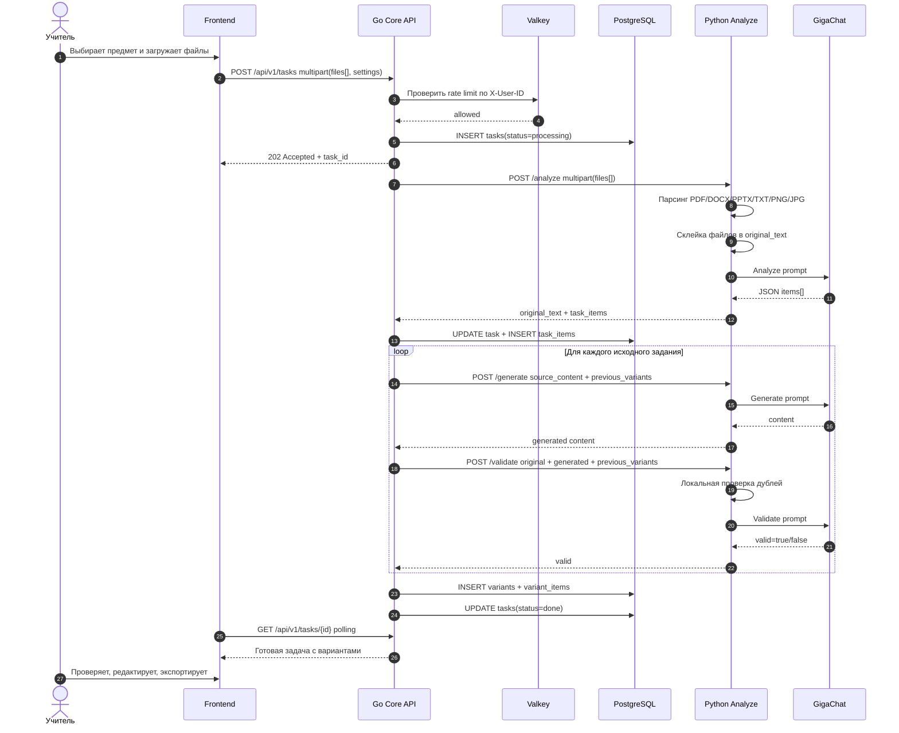
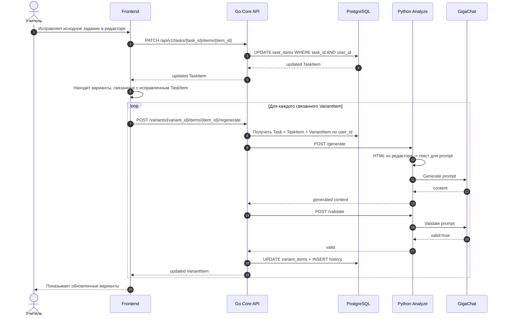
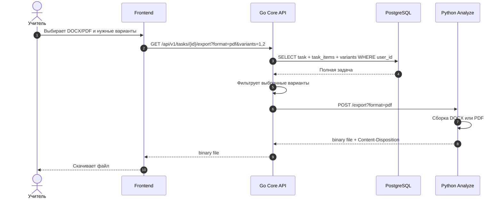

# C4 Mermaid diagrams

Готовые схемы для Mermaid Live Editor: https://mermaid.live

## 1. System Context

## 2. Container Diagram

## 3. Core API Component Diagram

## 4. Analyze Service Component Diagram

## 5. Sequence - создание и генерация работы

## 6. Sequence - редактирование исходника и автообновление вариантов

## 7. Sequence - экспорт DOCX/PDF

